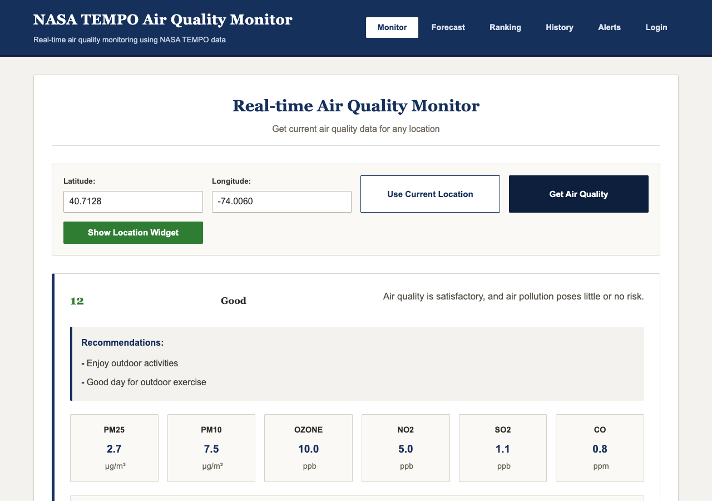
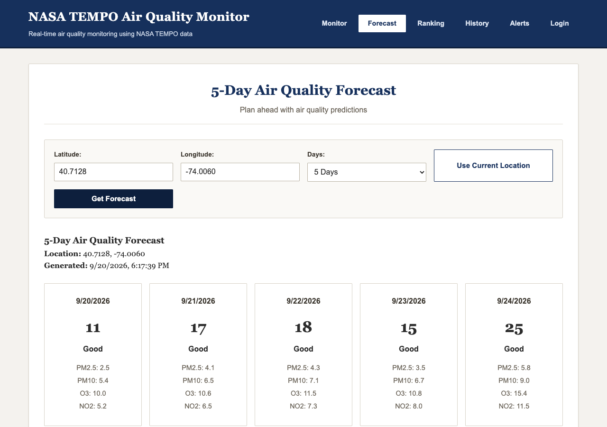
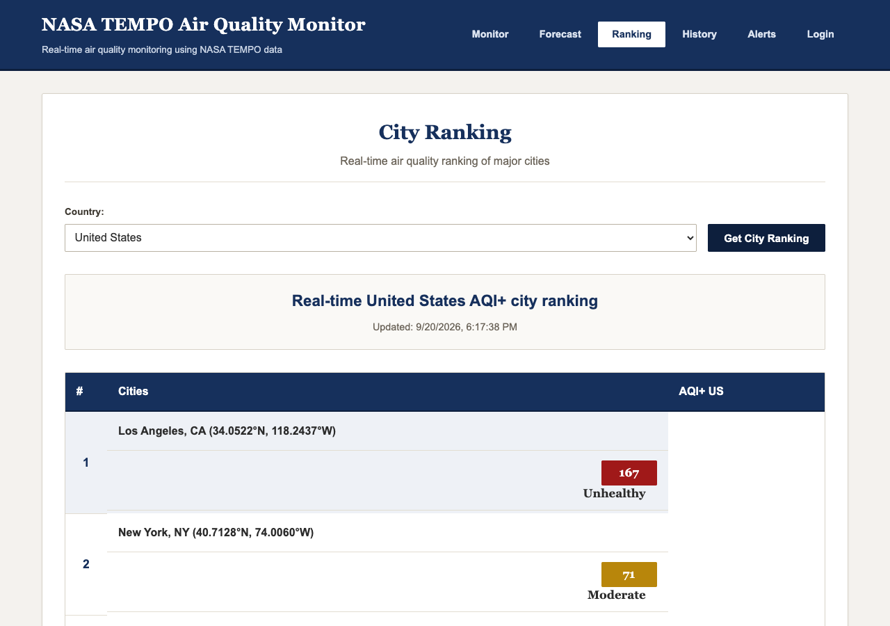
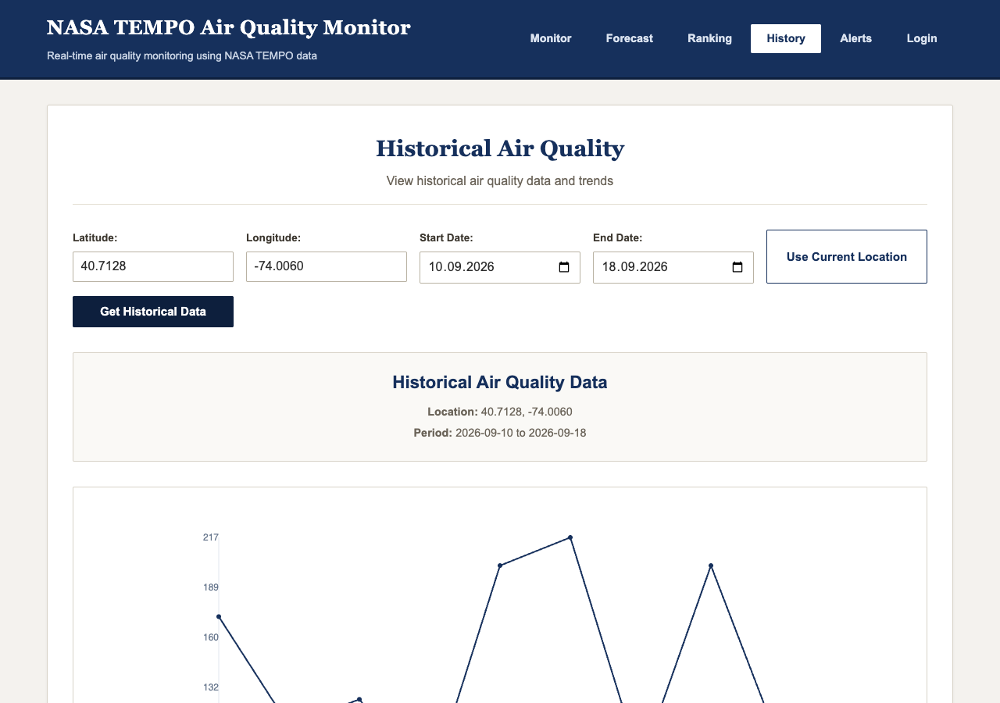

# NASA TEMPO Air Quality Monitor

A web app that shows the air quality index, pollutant breakdown, a 5-day forecast and a city ranking for any latitude/longitude, with the UI and API structured around NASA TEMPO satellite data. **The data is currently simulated** - see [Limitations](#limitations).

**Live demo:** https://nasaspace-app-tmpalish.azurewebsites.net

## Screenshots

| Monitor | Forecast |
|---|---|
|  |  |

| City ranking | Historical data |
|---|---|
|  |  |

## Features

- **Current air quality by coordinates:** AQI, category, health message, recommendations and PM2.5 / PM10 / ozone / NO2 / SO2 / CO values. A "Use Current Location" button fills in coordinates from the browser's geolocation.
- **5-day forecast** per location.
- **City ranking** for 8 countries (US, KZ, RU, CN, IN, DE, FR, GB).
- **Historical view** with a chart for a chosen date range.
- **Email alert subscription:** subscribing sends a welcome email (via Nodemailer, or logs it to the console when no SMTP credentials are set).
- **User accounts:** register, login and profile endpoints using bcrypt-hashed passwords and JWTs.
- **Redis caching** with an automatic in-memory fallback when Redis is unavailable.

## Architecture

```
Browser (static HTML/CSS/vanilla JS, served from public/)
   |  fetch /api/*            Socket.IO
   v
Express server (server.js: helmet, CORS, compression, rate limit 100 req / 15 min on /api)
   |
   +-- routes/      airQuality, weather, tempo, notifications, users
   |      |
   |      v
   +-- services/    airQualityService -> tempoService + weatherService + generated ground data
   |                notificationService (Nodemailer), userService (in-memory users, JWT)
   |                cacheService -> Redis, or in-memory Map if Redis is unreachable
   +-- middleware/  JWT auth, request validation
```

`airQualityService` combines the TEMPO, weather and ground-station inputs into an AQI. Responses are cached (15 min for current air quality).

## Tech stack

- **Backend:** Node.js (>= 18), Express 4, Socket.IO, Redis client (optional), JWT, bcrypt, Nodemailer, helmet
- **Frontend:** plain HTML/CSS/JavaScript, no build step
- **Testing:** Node's built-in test runner (`node --test`)
- **Deployment:** Docker, Docker Compose; CI on GitHub Actions

## Quick start

Requires Node.js 18 or newer.

```bash
git clone https://github.com/Alishnis/nasaspace-app.git
cd nasaspace-app
npm ci
cp .env.example .env     # defaults work as-is; edit to add real credentials
npm start
```

Open http://localhost:3003. `GET /health` returns a status check. Try the API:

```bash
curl "http://localhost:3003/api/air-quality/current?lat=40.7128&lng=-74.0060"
```

Use `npm run dev` for auto-reload (nodemon). Redis is optional: if it is not reachable the app logs a notice and uses an in-memory cache.

### Docker

```bash
cp .env.example .env
docker-compose up -d --build     # app + Redis, http://localhost:3003
```

The `Dockerfile` defines a `HEALTHCHECK` that calls `/health`.

A pre-built image is referenced at [hub.docker.com/r/tmpalish/nasaspace-app](https://hub.docker.com/r/tmpalish/nasaspace-app) (TODO(owner): confirm this image is current).

## Configuration

All variables are optional for local use. Copy [.env.example](.env.example) to `.env`; `.env` is git-ignored.

| Variable | Default | Purpose |
|---|---|---|
| `PORT` | `3003` | HTTP port |
| `REDIS_HOST`, `REDIS_PORT` | `localhost`, `6379` | Redis connection; falls back to in-memory cache if unreachable |
| `JWT_SECRET` | random per process | Signs user tokens. If unset, tokens stop working on restart. Set it in production |
| `EMAIL_SERVICE` | `gmail` | Nodemailer service name |
| `EMAIL_USER`, `EMAIL_PASS` | unset | SMTP credentials. If either is empty, emails are only logged, not sent |
| `EMAIL_HOST`, `EMAIL_PORT` | unset, `587` | Custom SMTP server instead of `EMAIL_SERVICE` |
| `TEMPO_API_KEY`, `TEMPO_API_URL` | `DEMO_KEY`, `https://api.nasa.gov/tempo` | Read by the code but **not used yet** (data is simulated) |
| `WEATHER_API_KEY` | unset | Read by the code but **not used yet** (weather is simulated) |

## Project structure

```
.
├── server.js            # Express + Socket.IO entry point
├── routes/              # Express routers (air quality, weather, tempo, notifications, users)
├── services/            # Business logic: air quality, TEMPO, weather, notifications, users, cache
├── middleware/          # JWT auth, request validation
├── public/              # Static frontend (index.html, css/, js/, images/)
├── test/                # Smoke and regression tests
├── docs/screenshots/    # README images
├── .github/workflows/   # CI (npm ci + npm test)
├── Dockerfile
├── docker-compose.yml
└── .env.example         # Environment variable template
```

## API

| Endpoint | Description |
|---|---|
| `GET /api/air-quality/current?lat=&lng=` | Current AQI and pollutants |
| `GET /api/air-quality/forecast?lat=&lng=&days=` | Multi-day forecast |
| `GET /api/air-quality/historical?lat=&lng=&startDate=&endDate=` | Historical series |
| `GET /api/air-quality/alerts?lat=&lng=` | Alerts for a location |
| `GET /api/air-quality/ranking?country=` | City ranking |
| `GET /api/weather/{current,forecast,historical}?lat=&lng=` | Weather |
| `GET /api/tempo/{data,data/:date,coverage}?lat=&lng=` | TEMPO-style satellite data |
| `POST /api/notifications/subscribe` | `{ lat, lng, email?, phone?, alertLevels? }` |
| `DELETE /api/notifications/unsubscribe/:id` | Remove a subscription |
| `GET/PUT /api/notifications/preferences/:userId`, `POST /api/notifications/test` | Preferences (placeholder responses), test notification |
| `POST /api/users/register`, `POST /api/users/login` | Returns `{ user, token }` |
| `GET/PUT /api/users/profile`, `DELETE /api/users/account` | Require `Authorization: Bearer <token>` |
| `GET /health` | `{ status, timestamp, uptime }` |

Location endpoints validate `lat` (-90..90) and `lng` (-180..180) and return 400 otherwise.

## Testing

```bash
npm test
```

Runs 8 tests with Node's built-in runner against an in-process server: health check, frontend serving, current air quality, coordinate validation, city ranking, the register/login/profile flow and notification subscription. CI runs the same command on every push and pull request.

## Limitations

Please read before treating any number in the app as real.

- **No real data source is wired up.** TEMPO, weather and ground-station values are generated with formulas plus `Math.random()` in `services/`. `TEMPO_API_KEY` and `WEATHER_API_KEY` are never used to make a request. Historical data is random, and the city ranking is a hardcoded list.
- The AQI calculation is a simplified approximation, not the official EPA method (see comments in `services/airQualityService.js`).
- **Alerts are not sent automatically.** Only a welcome email is sent on subscription; there is no logic that dispatches alerts when air quality changes. SMS and push are placeholders that only log.
- **Socket.IO live updates are not functional:** the client listens for `air-quality-update` and `alert`, but the server never emits them.
- Users and subscriptions are stored in memory and are lost on restart; there is no database.
- `public/js/map.js` (Leaflet map helper) is loaded but Leaflet itself is not included, so no map is shown.
- Login/register input is not validated beyond what bcrypt and the service require.

## Author's role

TODO(owner): describe your contribution (e.g. team size, which parts you built) and confirm the hackathon details. `package.json` lists the author as "NASA Space Apps Challenge 2024".

## License

MIT, as declared in `package.json`. TODO(owner): add a `LICENSE` file (none exists in the repo yet).
